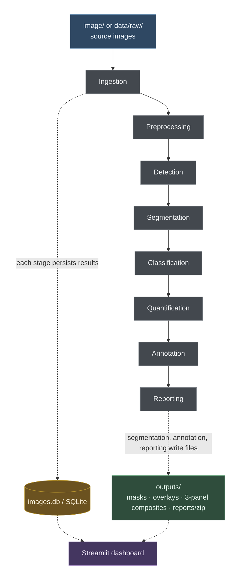
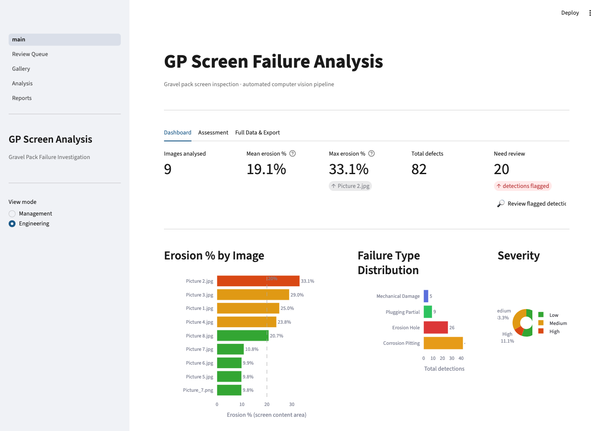
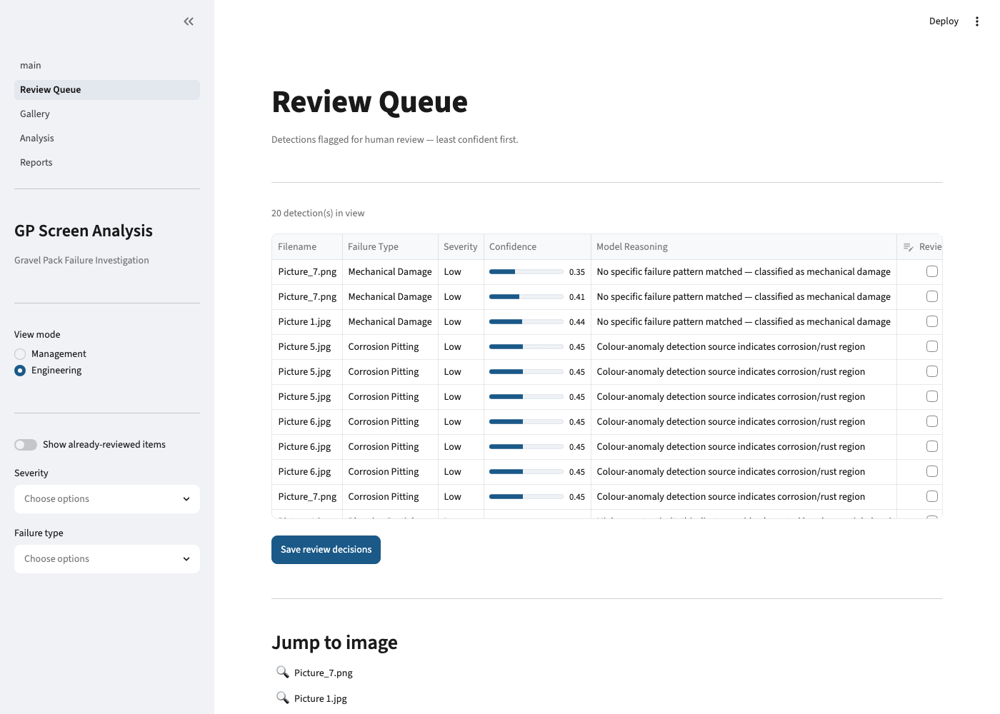
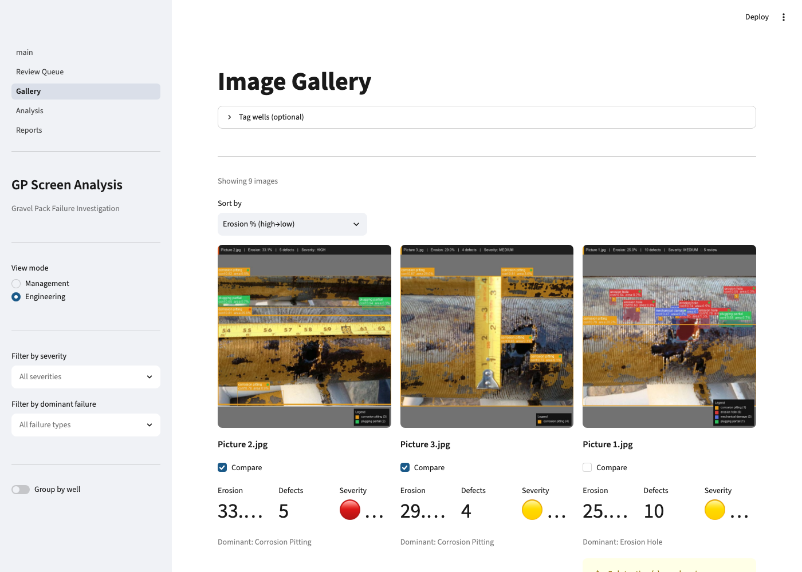
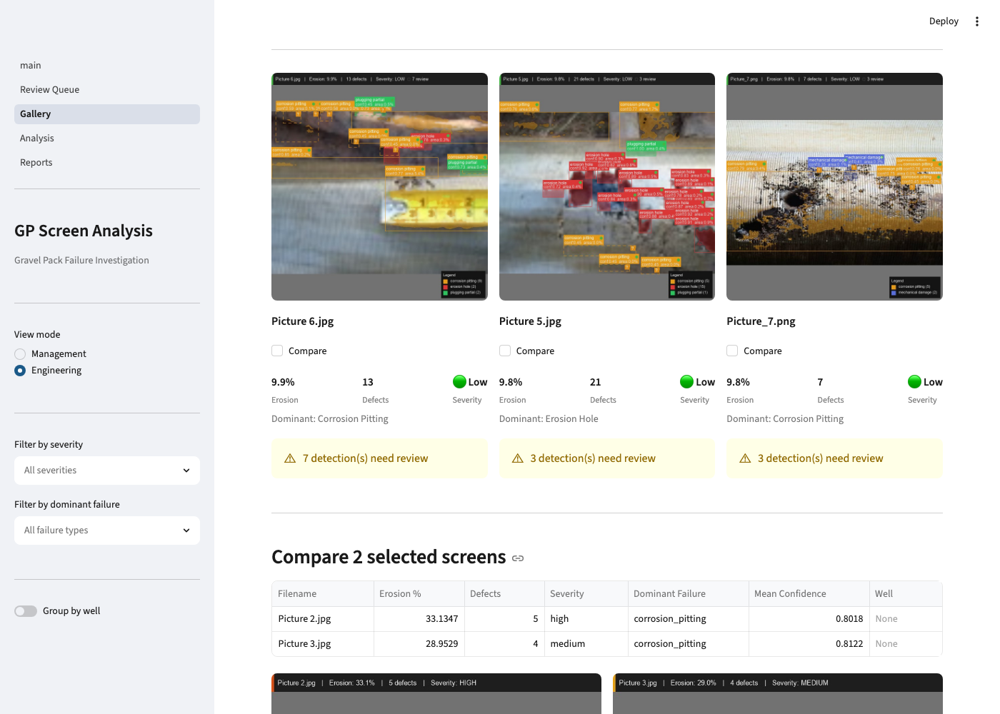
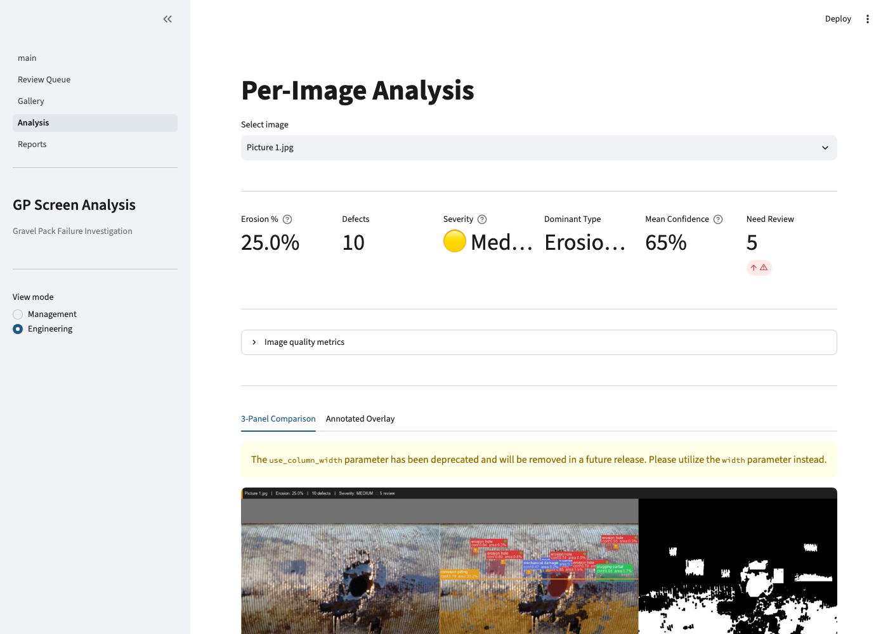
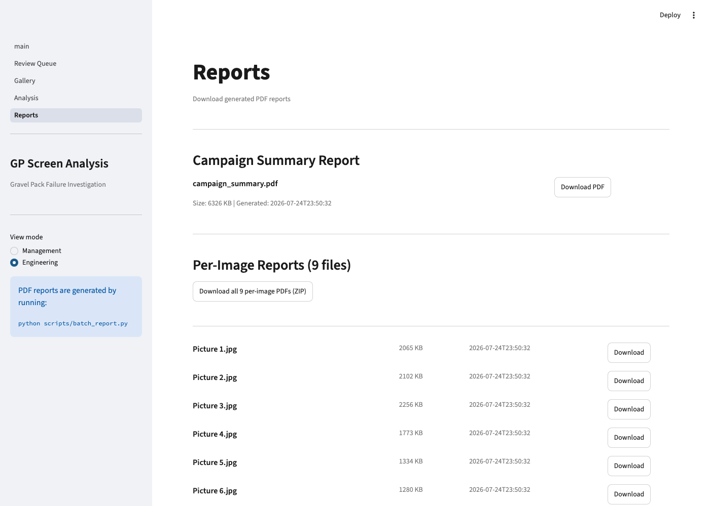

# GP Screens Analysis

Prototype computer vision workflow for analysing, annotating, and reporting potential failure modes on failed gravel pack (GP) screens from high-resolution inspection images.

---

## Business Objective

Failed gravel pack screens are retrieved from wells and inspected at surface. This project automates visual failure analysis — replacing manual, subjective assessment with structured computer vision outputs: defect segmentation, erosion quantification, failure type classification, severity scoring, and annotated reporting.

---

## Prototype Status

This project is currently a prototype built from a very limited image set: 9 inspection images. That dataset is not sufficient to train or validate a production-grade computer vision model.

At this stage, the pipeline is intended to demonstrate the end-to-end workflow: image ingestion, defect annotation, severity estimation, review queues, dashboard views, and report generation. Model outputs should be treated as experimental estimates, not validated engineering conclusions.

A larger, representative, engineer-labelled dataset will be required before the detection, segmentation, classification, and severity scoring components can be trained, benchmarked, and deployed for operational use.

See [Models & Methods](#models--methods) and [Validation](#validation) for what's actually implemented and measured today.

---

## Failure Modes Targeted

| Failure Mode | Description |
|---|---|
| Wire-wrap erosion holes | Localised perforation from abrasive sand flow |
| Screen collapse / crushing | Structural deformation from mechanical load |
| Corrosion pitting | Material loss from chemical attack |
| Mechanical damage | Impact or abrasion during running or retrieval |
| Plugging | Partial or complete pore blockage |
| Base-pipe exposure | Loss of screen jacket exposing the base pipe |

---

## Pipeline Stages

`Image/` or `data/raw/` (source, read-only) flows through eight sequential stages. Each
stage persists structured results to the shared SQLite database
(`data/processed/images.db`) before the next stage reads from it; Segmentation,
Annotation, and Reporting additionally write file artifacts to `outputs/`. The Streamlit
dashboard reads from both — the database for metrics, review state, classifications, and
well tags, and `outputs/` for the overlay/mask/panel images and report downloads it
displays:



**Legend** — solid: processing flow, stage to stage · dotted: everything else —
structured results persisted to `images.db / SQLite` (gold) or file artifacts written to
`outputs/` (green), and both being read back by the dashboard. Node colour: blue = source
input, grey = processing stage, gold = database, green = file outputs, purple = dashboard.

| Stage | Code | Responsibility |
|---|---|---|
| Ingestion | `src/ingestion/` | Load images, extract metadata, validate file types |
| Preprocessing | `src/preprocessing/` | Resize/letterbox to 640×640, CLAHE, denoise, screen-region detection |
| Detection | `src/detection/` | Localise defect bounding boxes |
| Segmentation | `src/segmentation/` | Per-defect binary mask generation |
| Classification | `src/classification/` | Failure type + severity assignment |
| Quantification | `src/quantification/` | Erosion %, defect count, diameter distribution |
| Annotation | `src/annotation/` | Overlay drawing, 3-panel composites |
| Reporting | `src/reporting/` | Per-image and campaign PDF reports |

Repository layout: `app/` (Streamlit UI) · `configs/` (YAML thresholds, see [Models & Methods](#models--methods)) · `data/` (`raw/`, `processed/`, `annotations/`) · `models/` (trained weights — empty by default, see below) · `outputs/` (`masks/`, `overlays/`, `panels/`, `reports/`) · `scripts/` (CLI batch + evaluation) · `tests/`.

---

## Models & Methods

**No trained model weights ship with this repo** (`models/` is empty). The default pipeline
is entirely classical computer vision and deterministic rules — no training data or GPU
required:

| Stage | Default method | Trained / pretrained? | Pluggable alternative |
|---|---|---|---|
| Detection | `ContourDetector` (`src/detection/contour.py`) — adaptive threshold + morphology + HSV colour-anomaly blob detection, tuned via `configs/detection_config.yaml` | Rule-based, not trained | `YOLOv8Detector` (`src/detection/yolo.py`) — wraps Ultralytics YOLOv8, but requires a `weights_path` to a custom-trained checkpoint. With no weights it reports `ready=False` and returns zero detections rather than falling back to generic COCO classes. No such checkpoint is included or has been trained. |
| Segmentation | `ContourMaskSegmenter` — mask derived directly from the same contour output as detection | Rule-based, not trained | `GrabCutSegmenter` (classical, no training needed) or `SAMSegmenter` (Meta's Segment Anything, zero-shot but requires downloading SAM weights separately — not bundled) |
| Classification | `RuleBasedClassifier` (`src/classification/`) — hand-coded decision rules over shape/colour features (circularity, aspect ratio, solidity, brightness, saturation) extracted per detection | Deterministic rules, not a trained classifier | None currently implemented |
| Severity scoring | Erosion-% thresholds in `configs/severity_config.yaml` (0–5 / 5–20 / 20–50 / >50 → low/medium/high/critical), with collapse/complete-plugging escalated one level | **Engineering defaults, not SME-validated or calibrated against historical failure data** — this is stated explicitly in the code (`app/components/interpretation.py`) and is the single biggest gap before any operational use | Edit `configs/severity_config.yaml` |
| Root causes & recommended actions | Static, hand-authored template text keyed by failure type and severity (`app/components/interpretation.py`) | **Deterministic templates, not model-generated, not LLM-generated, and not confirmed to be SME-reviewed.** They read as plausible completions-engineering guidance but should be treated as a starting checklist, not an authoritative diagnosis, until reviewed by a qualified engineer | Edit `_FAILURE_NARRATIVES` / `_POTENTIAL_CAUSES` in `app/components/interpretation.py` |

Everything in the pipeline is deterministic (no random seeds are used anywhere in `src/`)
— the same input image always produces the same output.

### Validation

**The current value of this project is the end-to-end workflow, dashboard, reporting
layer, and evaluation harness — not production-grade defect detection.** The numbers
below exist so that claim is checkable, not asserted; read them as a baseline for the
default rule-based pipeline to improve against, not as a verdict on the concept.

Ground-truth labels now exist for all 9 demo images in `data/annotations/` — 8 images
with box annotations (all but `Picture 4.jpg`) and 5 with polygon masks — created with
the bundled interactive labeling tool (`scripts/label_image.py`) by the project author —
**not independently reviewed by an engineer or SME**. Running the bundled evaluators
against them (`python scripts/evaluate_detection.py`, `python scripts/evaluate_segmentation.py`)
on the current default (contour) pipeline gives:

| Task | Images scored | Result |
|---|---|---|
| Detection (box IoU ≥ 0.5) | 8 | Precision 0.01, Recall 0.06, F1 0.02, mean IoU **0.75** on matched boxes only (1 TP / 73 FP / 17 FN) |
| Segmentation (composite mask) | 5 | Precision 0.10, Recall 0.20, Dice 0.13, mean IoU 0.08 |

Still a small sample by CV standards, but large enough now to see a consistent pattern,
not just noise: **the default contour detector over-fires badly** — across the 8 scored
images it produces 74 predicted boxes against 18 ground-truth boxes, so precision is
poor almost by construction — **and still misses most real defects** (17 of 18 ground
truth boxes have no matching prediction, recall 0.06). The one true positive it does get
right is a tight match (IoU 0.75), so when the detector is right it's not merely
"in the neighbourhood" — it's precisely localised; the failure mode is specificity
(too many spurious boxes, largely from the colour-anomaly detector) and coverage (most
real defects never get a matching box at IoU ≥ 0.5), not gross imprecision. Segmentation
shows the same shape: composite masks over-predict area (pooled predicted pixels are
roughly 2–7× the labeled pixels per image) while still under-covering the true defect
region. Treat this project as a working prototype and evaluation harness, not a
validated detector — `configs/detection_config.yaml`'s NMS/containment thresholds and
`run_color_anomaly` flag are the first places to tune down the false-positive rate. A
trained `YOLOv8Detector` or `SAMSegmenter` should also be benchmarked against the same
harness once weights exist.

---

## Dataset

The 9 images in `Image/` (`Picture 1.jpg` – `Picture 8.jpg`, plus `Picture_7.png`) are the
**entire dataset shipped with this repo** — a small demonstration set, not a production
training or validation corpus. They cover a mix of corrosion pitting, erosion holes,
mechanical damage, and plugging at varying severities, but with no claim of being
representative of the full failure-mode/severity distribution described in
[Failure Modes Targeted](#failure-modes-targeted). Because they ship in the repo, the
[Batch Inference](#batch-inference-cli) command and Streamlit dashboard both run
end-to-end out of the box with no data setup required. To analyse real inspection images,
place them in `Image/` or `data/raw/` in place of (or alongside) the sample set.

---

## Installation

- **Python**: 3.11 (pinned in `.python-version`)
- **OS**: developed and tested on macOS; no OS-specific code paths, but Windows/Linux are
  untested
- **GPU**: not required. The default detection/segmentation/classification path is
  CPU-only classical CV. `torch`, `torchvision`, and `ultralytics` are still installed
  (they're on the pluggable YOLOv8/SAM path — see [Models & Methods](#models--methods))
  and make the environment noticeably heavy (~1.8 GB, mostly `torch`) even though the
  default pipeline never imports them
- **Sample data included**: the 9 images in `Image/` mean the app and CLI both run
  immediately after install with no data of your own required

```bash
git clone https://github.com/djimrastephane/GP_Screens_Analysis.git
cd GP_Screens_Analysis
python -m venv .venv
source .venv/bin/activate        # Windows: .venv\Scripts\activate
pip install -r requirements.txt
```

---

## How to Run

### Streamlit Dashboard

```bash
streamlit run app/main.py
```

Open [http://localhost:8501](http://localhost:8501) in your browser.

### Batch Inference (CLI)

```bash
python scripts/batch_inference.py --input Image/ --output outputs/
```

---

## Dashboard Pages

Five pages, organised around what an engineer actually needs to do rather than
around pipeline stages. Role-based views are available on every page —
Engineering users see full technical detail; management views show summary
KPIs and trends. The Management/Engineering choice persists as you navigate
between pages.

### Overview — Campaign Dashboard, Assessment & Full Data
<picture>
  <source media="(prefers-color-scheme: dark)" srcset="docs/screenshots/01_overview_dark.png">
  
</picture>

Three tabs on one page instead of three separate ones. **Dashboard**: campaign KPIs (images analysed, mean/max erosion %, total defects, review flags — with a direct link into the Review Queue when any are flagged), erosion % bar chart ranked by severity, failure type distribution, and severity breakdown. **Assessment**: colour-coded campaign risk banner, observed conditions generated from actual data, morphological classification basis per failure type, potential root causes, and prioritised recommended actions. **Full Data & Export**: erosion-vs-defect-count scatter, the complete per-image metrics table, and CSV export for both the metrics table and the full defects table.

### Review Queue — Triage Worklist
<picture>
  <source media="(prefers-color-scheme: dark)" srcset="docs/screenshots/02_review_queue_dark.png">
  
</picture>

Every detection flagged for human review, sorted least-confident-first, with the model's own reasoning string per row. Mark items reviewed inline (persisted to the database, not just session state) and the queue shrinks — toggle "show already-reviewed" to bring them back. Filter by severity or failure type, and jump straight to the full per-image view for any row.

### Gallery — Browse, Tag Wells & Compare Screens
<picture>
  <source media="(prefers-color-scheme: dark)" srcset="docs/screenshots/03_gallery_dark.png">
  
</picture>

Thumbnail grid of annotated screen images, sortable and filterable by severity or dominant failure type. Tag images with a well name and completion zone, then group the grid by well. Select two or more screens for comparison:

<picture>
  <source media="(prefers-color-scheme: dark)" srcset="docs/screenshots/03b_gallery_compare_dark.png">
  
</picture>

Side-by-side metrics table and annotated thumbnails for just the selected screens, plus an erosion % chart scoped to the comparison.

### Analysis — Per-Image Detail
<picture>
  <source media="(prefers-color-scheme: dark)" srcset="docs/screenshots/04_analysis_dark.png">
  
</picture>

Six KPI cards: erosion % (formula tooltip), defect count, severity (threshold tooltip), dominant failure type, mean model confidence, and review flag count. Engineering view adds: image quality panel (focus score, illumination, quality flag, screen coverage); auto-generated engineering assessment with risk level, likely mechanism, plain-English interpretation, and morphological classification basis explaining *why* the failure type was assigned; scale calibration UI to enter pixels/mm from a visible ruler — instantly converts all diameters to mm and areas to cm²; per-defect table with the model's own reasoning string per detection and an inline reviewed checkbox that stays in sync with the Review Queue. Reachable directly from a Review Queue row, landing on the right image.

### Reports — PDF Downloads
<picture>
  <source media="(prefers-color-scheme: dark)" srcset="docs/screenshots/05_reports_dark.png">
  
</picture>

Download the campaign summary PDF or individual per-image annotated engineering reports as a ZIP archive.

---

## Expected Inputs

- JPEG or PNG inspection images of failed GP screens
- Optional: CSV or Excel with well and completion context (well name, depth, completion type, sand production history)

Place source images in `Image/` or `data/raw/`. Do not modify source files — the pipeline preserves originals unchanged.

---

## Outputs

| Output | Location | Description |
|---|---|---|
| Binary masks | `outputs/masks/` | Defect regions per image |
| Annotated overlays | `outputs/overlays/` | Source image with overlaid detections |
| 3-panel composites | `outputs/panels/` | Original / annotated / mask side-by-side |
| Results CSV | `data/processed/` | Tabular failure classification and metrics |
| PDF reports | `outputs/reports/` | Per-image annotated engineering report |

---

## Key Metrics

| Metric | Definition |
|---|---|
| Erosion % | Total defect pixel area ÷ visible screen pixel area × 100. Model estimate of damaged area fraction — not a direct measurement of metal loss or open-flow area increase. |
| Severity | < 5 % → Low · 5–20 % → Medium · 20–50 % → High · ≥ 50 % → Critical. Screen collapse and complete plugging escalate one level regardless of area. Configurable engineering defaults (`configs/severity_config.yaml`) — see [Models & Methods](#models--methods) for validation status. |
| Mean confidence | Average model confidence across all detections for the image (0–100 %). Detections below 65 % are flagged for human review (`confidence_review_threshold` in `configs/severity_config.yaml`). |
| Largest defect % | Area of the single largest detected defect as % of visible screen area. More indicative of breach severity than defect count alone. |
| Largest diameter | Equivalent circular diameter of the largest defect (pixels, or mm when scale is calibrated from a ruler in the image). |
| Damage density | Defects per cm² of screen area (requires scale calibration). |
| Total damaged area | Cumulative defect area in cm² (requires scale calibration). |
| Defect count | Number of distinct failure locations detected per image. |
| Failure type distribution | Breakdown by failure mode across the full campaign. |

---

## Design Principles

- Source images are never modified
- All model outputs are estimates; critical findings are flagged for human review
- Confidence scores are reported on all classification outputs
- Poor image quality is flagged before inference runs
- Outputs are traceable back to the source image at every stage

---

## Assumptions & Limitations

- Images are taken at surface after screen retrieval; downhole images are not supported
- Accuracy degrades on severely occluded, blurry, or very low-resolution images
- Erosion percentages are relative to the detected screen region, not absolute screen area
- Scale references are not always present; absolute measurements in mm require image calibration
- The default detection/segmentation/classification stages are rule-based, not trained on
  a labelled dataset, so there is no "training distribution" to generalise from — behaviour
  depends entirely on how well the hand-tuned thresholds in `configs/*.yaml` match a given
  image, and measured accuracy against the (very small) ground-truth set is currently poor
  — see [Validation](#validation)
- Severity thresholds and the root-cause / recommended-action text are engineering-style
  defaults authored for this project, not confirmed SME-reviewed or calibrated against
  historical failure data — see [Models & Methods](#models--methods)

---

## Target Users

- **Engineering / Completions** — detailed failure classification, root cause hypotheses (template-based, for engineering review — see [Models & Methods](#models--methods)), export-ready reports
- **Well Integrity / HSE** — failure documentation for regulatory records and re-completion design
- **Management** — asset-level failure rate trends, severity distribution, sand control risk ranking
